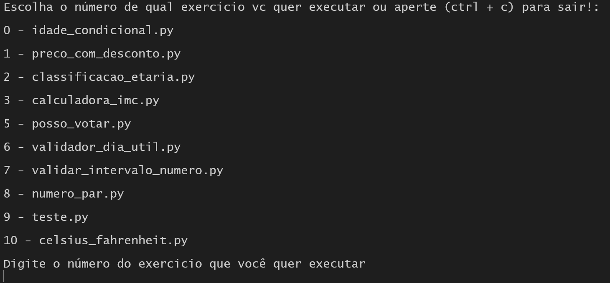

# Repositório dos exercícios de fundamentos Python - EDN

## Instruções
Você pode rodar o arquivo **"main.py"** para abrir um menu de escolha conforme a imagem abaixo:




## Estrutura do repositório
```bash

├── aula01
│   ├── atividades
│   │   ├── idade_condicional.py
│   │   ├── preco_com_desconto.py
│   ├── teoria
│   │   ├── comentarios.py
│   │   ├── comparacao.py
│   │   ├── indentacao.py
│   │   ├── matematica.py
│   │   ├── tipos.py
│   │   ├── variaveis.py
├── aula02
│   ├── atividades
│   │   ├── __pycache__
│   │   ├── calculadora_imc.py
│   │   ├── celsius_fahrenheit.py
│   │   ├── classificacao_etaria.py
│   │   ├── numero_par.py
│   │   ├── posso_votar.py
│   │   ├── teste.py
│   │   ├── validador_dia_util.py
│   │   ├── |validador_intervalo_numerico.py
|   │
|   │
├── aula03
│   ├── atividades
│   │   ├── calculadora.py
│   │   ├── media_alunos.py
│   │
│   │
├── aula04
│   ├── atividades
│   │   ├── contador_par_impar.py
│   │   ├── validador_de_senha.py
│   │
│   │
├── main.py
```